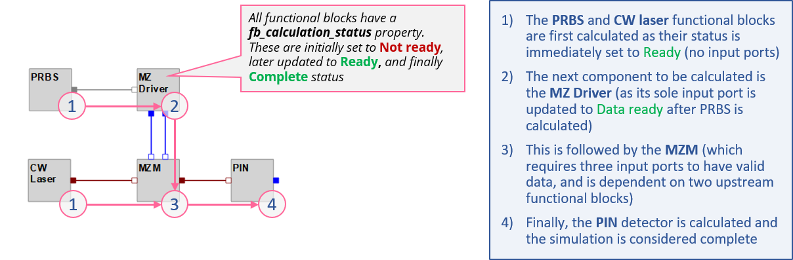

.. _simulator-operations-label:

How the simulator works 
=======================

Basic logic flow
----------------

SystemLab|Design utilizes a **block-based** simulator to model the performance of virtual systems. 
Before calculating the output signals for a specific functional block, any **upstream** blocks 
that are connected to this functional block (through its input ports) must first be calculated, 
and so on, all the way to the **source** transmitters (which do not require input port(s) to 
perform their calculations).

As the connection layout for a system design is not known prior to starting a simulation, 
the simulator algorithm (which is managed by the **calculation_orchestrator** method) uses a 
query-based methodology (*while True* loop) to ensure that all connected functional blocks 
are calculated in the correct sequence.

To achieve this, all functional blocks are equipped with an **fb_calculation_status** flag that 
notifies the orchestrator when its "Ready" for calculation (this is triggered when all input 
ports for the fb have received valid signal data from upstream sources).

After completing a calculation, the functional block will update its status to "Calculation 
complete". Once the entire list of functional blocks for a design has reached the 
"Calculation complete" stage, the simulation is considered complete. 

For further details on the simulator algorithm model, see :ref:`main-simulator-label`.

    
    Fig 1: Example calculation flow for a design project

Interpreting the simulator status panel
---------------------------------------

During the simulation, status messages are sent to the **Simulation status** dialog. 
Status messages are received from the *Main simulation loop* (providing information on the 
status of each functional block in the simulation and the current iteration/feedback segment 
being run) and the fb_scripts themselves. The latter messages are important as they capture 
any data or issues/errors that may have occured while running the script module for any 
functional block.

An example of a typical stream of status messages is shown in Fig 2. Explanations are 
included on how to interpret the various message blocks.
    
 .. figure:: Simulation_Overview_2.png
    :align: center
    :alt: Fig 2: Simulation status dialog (example output)
    :figclass: align-center
    
    Fig 2: Simulation status dialog (example output)
    
Error message handling during a simulation (examples)
-----------------------------------------------------

Example 1: Incorrect script name
^^^^^^^^^^^^^^^^^^^^^^^^^^^^^^^^

In this example, the script for the *MZ (Mach Zehnder) Driver* was incorrectly entered 
(*"MZ_Driver_PIN_1"* vs *"MZ_Driver_PIN"*). After attempting to find the module in the main scripts 
library and both project-defined paths, a **ModuleNotFoundError** exception was raised and a 
message issued advising the user that no module named *MZ_Driver_PIN_1* exists.

The same type of error will be raised if a project file path is incorrectly entered or if 
the scripts_path_list (linked to the functional block library) does not contain the path 
for the specified module.
    
  .. figure:: Simulation_Overview_3.png
    :align: center
    :alt: Fig 3: Example error message for "module not found"
    :figclass: align-center
    
    Fig 3: Example error message for "module not found"

Example 2: Parameter field data not entered correctly
^^^^^^^^^^^^^^^^^^^^^^^^^^^^^^^^^^^^^^^^^^^^^^^^^^^^^

In this example, the parameter for the **Peak-to-peak amplitude** of the *MZ (Mach Zehnder) 
Driver* was left blank. When attempting to read this parameter, a **ValueError** exception was 
raised within the fb_script routine (expecting to see a float number but instead it read 
a string/blank field). 

When an exception is raised at any point in the fb script module, the simulation will be 
halted and a detailed error message will be posted to the **Simulation status** panel. This 
approach ensures that information on a problem (including the line number in the script), 
and the affected functional block location, are quickly presented to the user.

  .. figure:: Simulation_Overview_4.png
    :align: center
    :alt: Fig 4: Example error message for a "value error"
    :figclass: align-center
    
    Fig 4: Example error message for a "value error" (in this case the input parameters list)
    
    
Questions & Answers
-------------------

**If a functional block/component is not ready when queried by the simulation routine what 
happens next?**

Frequently, especially in larger, more complex designs, downstream functional blocks will 
remain in the "Not ready" state over several repetitions of the **while True** loop. To plan for 
this, each functional block has been equipped with a status counter that is set by default 
to 10. Each time the main simulation loop retrieves the status for a functional block, the 
counter increments by 1 if its status is still in the "Not ready" state. If the counter limit 
is exceeded, the status of the functional block will be changed to "Unable to complete 
calculation" and will be ignored by the main simulation loop for the remainder of the 
while True loop. This is important as some functional blocks may never be ready for 
calculation (for example if one of their input ports has not been connected to an upstream 
source) and will result in infinite loop conditions!

  .. tip::
    You can change the max allowed calculation attempts setting in the 
    **Project Properties/Advance settings** tab 

**Is it OK if I don’t connect all my components in the design? Will the simulator still run?**

Yes, the simulation routine will still run to completion but will advise the user that it 
was unable to complete the calculations for some of the functional blocks in the design 
layout. Designs are frequently works in progress (some sections may be incomplete) and 
should not limit the ability to perform the assessment of 
working sections of a design. 

