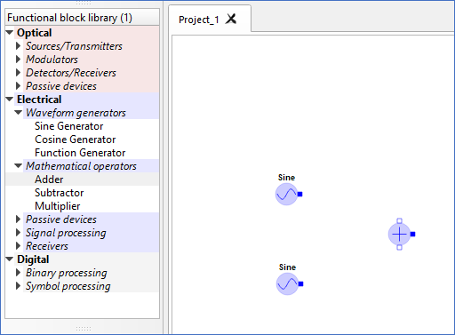
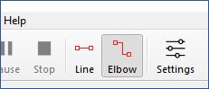
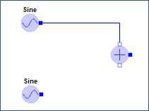
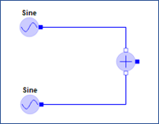
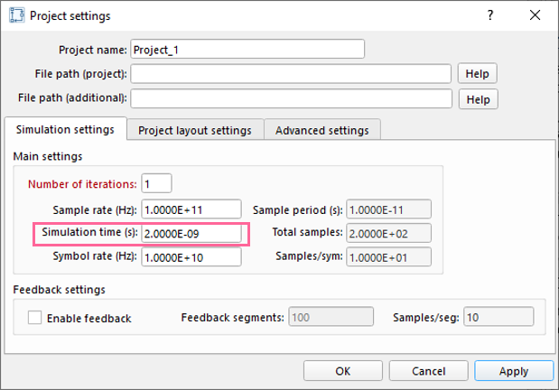
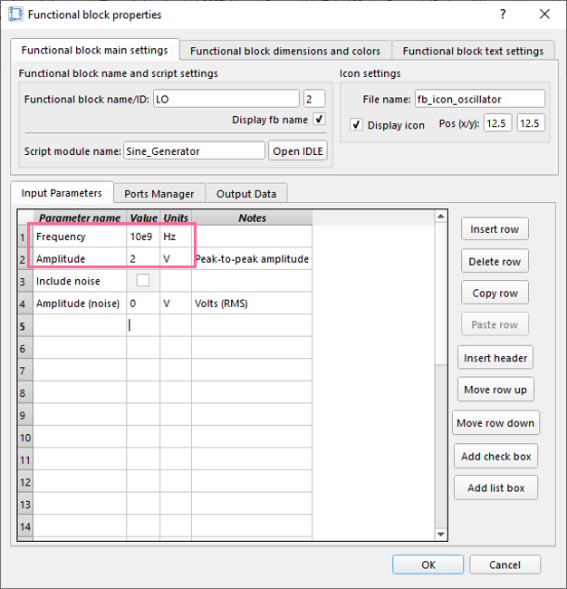
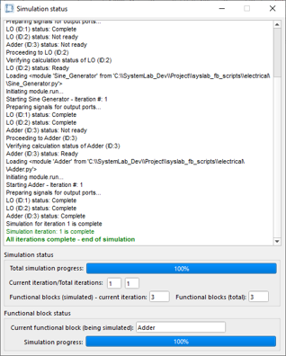
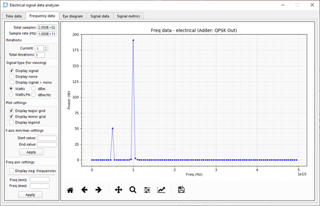

Quick start 1: Build & simulate a basic design
==============================================

In the following quick start tutorial, we will drag and drop sinusoidal signal generators
from the **Functional block library** and combine their outputs via an adder to 
demonstrate a simple sinusoidal adder design.

**Part 1: Drag and drop the required components onto the design layout**

1.  Launch a new application of SystemLab|Design by double left-clicking on the *SystemLab-Design.exe* 
    executable file.
#.  Go to the **Functional block library** (left panel of GUI) and hover over the triangle
    in front of the *Waveform generators* group (under **Electrical**).
#.  Left-click mouse to expand the menu.
#.  Left-click select and hold over the **Sine Generator** component and starting moving
    your mouse towards the design scene for Project_1.
#.  Release the mouse button anywhere over the design layout.     
    *[An icon representing a sinusoidal signal generator should appear on the layout]*.                
#.  Using the same procedure, add another **Sine Generator** and an **Adder**
    (from under the *Mathematical operators* group).
#.  Arrange the three components in the project layout as shown below.

**Part 2: Connect ports and adjust main simulation settings**

8.  On the upper tool bar of the SystemLab|Design interface, click on the **Elbow** connector
    button
   

    
9.  Starting from the upper **Sine** functional block, hover over the output port (small 
    blue rectangle) and left-click select/hold your mouse *[black cross hairs should appear
    above the port icon]*.
10. Move the mouse cursor towards the upper input port of the **Adder** functional block
    and release the mouse once the cursor is directly stationed over the port *[the 
    connection should complete as shown below]*.
   

    
11. Repeat the same procedure for the lower Sine generator.

    
12. Select the **Settings** icon on the on the **Tool bar**, and within the **Simulation
    settings** tab of the **Project settings** dialog, change the **Simulation time**
    from 1.000E-08 to 2.0E-9 (as shown below).

    
13. Select **OK** to save and close the **Project settings** dialog.

**Part 3: Adjust the parameters for the upper LO, run simulation and view results**

14. On the design layout (Project_1), double left-click on the lower **Sine** functional block. 
    *[The Functional block properties dialog will open]*.
15. Within the **Input parameters** tab, change the value of the **Frequency** from 5e9 to 10e9
    and the **Amplitude** from 1 to 2.
   

     
16. Select **OK** to save the settings and close the **Functional block properties** dialog.
17. From the **Tool bar**, click on the blue **Start** button (blue triangle) to launch the 
    simulator. *[The Simulation status dialog should indicate that all iterations (in this
    case one) were successfully completed!]*.

    
18. Close the **Simulation status** dialog by left-clicking on the **x** icon in the top right 
    corner of the dialog.
19. To review the signal results for our simulation, position the mouse cursor over the
    output (dark filled) port of the **Adder** functional block. Once the cross-hairs appear,
    double left-click on your mouse to open the **Electrical signal data analyzer**.
      
    *The first tab shows the time-domain sampled signal for the simulation. If we select
    the second tab we can view the frequency-domain data for the same sampled data set.
    As expected, we can see both sinusoidal frequency components for the sampled signal:
    5 GHz and 10 GHz. Also, as the frequency data is in power units, we see that the
    10 GHz frequency component is roughly 4 times greater (or twice the amplitude)
    than the 5 GHz signal*.
   
    *Similarly, you can double left-click over any other port in a design scene to view the
    sampled signal data (entering or exiting a functional block)*.
    

    
20. To close the **Electrical signal data analyzer** dialog, left-click on the **x** icon 
    in the top right corner of the dialog.
21. You can save the project by going to **File/Save project** or **File/Save project as** in the 
    **Menu bar**. *[By default the project will be saved within the "systemlab_main" folder 
    (as a ".slb" format)]* 
22. To close the project, either select **File/Close project** or the Close tab **x** icon for 
    the project.
    
    
    
    
